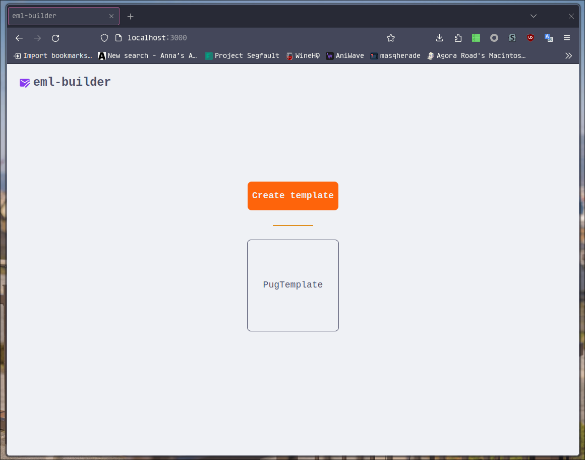
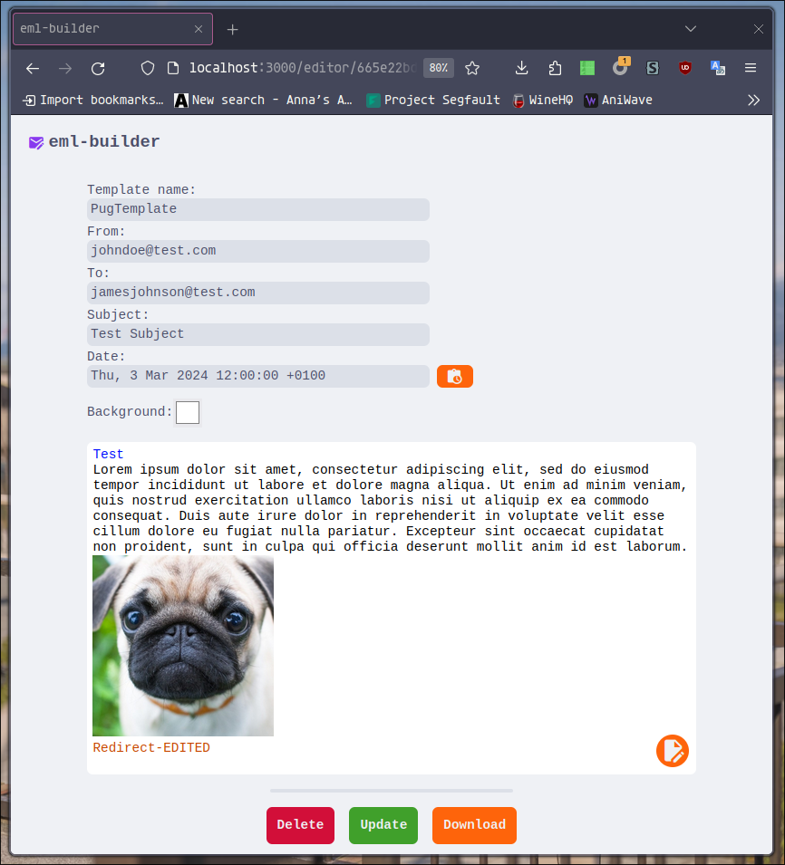

# eml-generator

Web-based eml generator :feather:

## Preview




## -Tech Stack-

- MongoDB
- Express
- React
- Node

## Development

Install dependencies:

`npm install`

ENV setup:
`export DATABASE_URI`

Or put DATABASE_URI into '.env' file.

Run in Dev mode:

`npm run dev`

Build:

`npm run build`

Run in Prod mode:

`npm run start`

## Structure

```

├── index.html
├── LICENSE
├── package.json
├── package-lock.json
├── public
│   ├── fonts
│   │   └── Symbols.ttf
│   └── PugTemplate.eml
├── README.md
├── src
│   ├── client
│   │   ├── App.jsx
│   │   ├── Content.jsx
│   │   ├── EditorBlocks
│   │   │   ├── ComponentEditor.jsx
│   │   │   ├── EditorButtonPanel.jsx
│   │   │   ├── EditorComponent.jsx
│   │   │   ├── EditorComponentsPanel.jsx
│   │   │   ├── EditorHeader.jsx
│   │   │   ├── EditorView.jsx
│   │   │   └── EditToolbar.jsx
│   │   ├── Editor.jsx
│   │   ├── Header.jsx
│   │   ├── main.jsx
│   │   ├── Preview.jsx
│   │   ├── styles
│   │   │   ├── ComponentEditor.css
│   │   │   ├── Content.css
│   │   │   ├── Editor.css
│   │   │   ├── Header.css
│   │   │   ├── index.css
│   │   │   └── Templates.css
│   │   └── Templates.jsx
│   └── server
│       ├── configs
│       │   └── dbConn.js
│       ├── controllers
│       │   ├── mailController.js
│       │   └── toEmlController.js
│       ├── main.js
│       ├── middleware
│       ├── model
│       │   ├── Mail.js
│       │   └── TemplateName.js
│       └── routes
│           └── api
│               ├── emlExport.js
│               └── mailTemplate.js
└── vite.config.js

14 directories, 36 files

```

## TODO;

- Add iframe preview
- Add free styling support
- Add separate template table for selection
- Check validation

## Others

### To add new style support: 
- Add new attribute to the schema in 'src/server/model/Mail.js'
- Fill in the attribute into the exporting eml in 'src/server/controllers/toEmlController.js'
- Add to the handleConfirmEdit handler and handleDragStartNew handler in 'src/client/Editor.jsx'
- Add new state hook in 'src/client/EditorBlocks/EditorComponent.jsx'
- Add it to useEffect
- Write a handler
- Pass props to EditToolbar and ComponentEditor, accept and add styles to the
element
